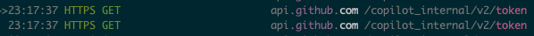
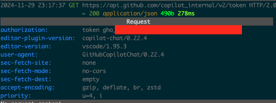

# copilot-more

`copilot-more` maximizes the value of your GitHub Copilot subscription by exposing models like gpt-4o and Claude-3.5-Sonnet for use in agentic coding tools such as Cline, or any tool that supports bring-your-own-model setups. Unlike costly pay-as-you-go APIs, this approach lets you leverage these powerful models affordably. (Yes, $10 per month maximum.)

The exposed models aren't limited to coding tasks—you can connect any AI client and customize parameters like temperature, context window length, and more.


## 🏃‍♂️ How to Run

1. Get the refresh token

   A refresh token is used to get the access token. This token should never be shared with anyone :). You can get the refresh token by following the steps below:

   - Install mitmproxy and it's certificate. Installing the certificate takes a little effort. I have mitmproxy certificates installed before this project. I actually don't know if certificates are actually needed. Feel free to skip the certificates and come back to this step if you hit a blocker. For installing the mitmproxy certificate, you can follow the instructions from the official doc https://docs.mitmproxy.org/stable/concepts-certificates or you can refer to my other project's README https://github.com/jjleng/copilot-proxy
   - Run `mitmproxy` in the terminal. By default, it will start a proxy server on port 8080.
   - Open another terminal and run `HTTP_PROXY=http://localhost:8080 HTTPS_PROXY=http://localhost:8080 code`. If you don't have the `code` command in your system, you can Google it. This will open VS Code with the proxy settings. Another way is to set the proxy settings in the VS Code settings. See the README of https://github.com/jjleng/copilot-proxy. This step assumes that you have already subscribed to GitHub Copilot and have the Copilot extension installed in VS Code.
   - In the terminal where you ran `mitmproxy`, you will see the requests made by the Copilot extension. Look for the request that has the URL `https://api.github.com/copilot_internal/v2/token`. See the screenshot below.
     <div align="center">
      
     </div>
     Press `enter` on the request to see the details. Look for the `Authorization` header. This header contains the refresh token. The value of the `Authorization` header looks like `token gho_xxxxxx`. Copy the string `gho_xxxxxx`. This is your refresh token. See the screenshot below.
      <div align="center">
      
     </div>

1. Install and run copilot_more

    ```bash
    git clone https://github.com/jjleng/copilot-more.git
    cd copilot-more
    # install dependencies
    poetry install
    # run the server. Replace gho_xxxxx with the refresh token you got in the previous step. Note, you can use any port number you want.
    REFRESH_TOKEN=gho_xxxxx poetry run uvicorn copilot_more.server:app --port 15432
    ```


## ✨ Magic Time
Now you can connect Cline or any other AI client to `http://localhost:15432` and start coding with the power of GPT-4o and Claude-3.5-Sonnet without worrying about the cost. Note, the copilot-more manages the access token, you can use whatever string as API keys if Cline or the AI tools ask for one.


## 🤔 Limitation

The GH Copilot models sit behind an API server that is not fully compatible with the OpenAI API. You cannot pass in a message like this:
    {
      "role": "user",
      "content": [
        {
          "type": "text",
          "text": "<task>\nreview the code\n</task>"
        },
        {
          "type": "text",
          "text": "<task>\nreview the code carefully\n</task>"
        }
      ]
    }
copilot-more takes care of this limitation by converting the message to a format that the GH Copilot API understands. However, without the `type`, we cannot leverage the models' vision capabilities, so that you cannot do screenshot analysis.
